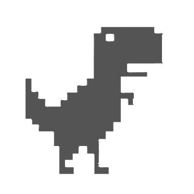

<html>
<head>
<title>S-ORAX About</title>

</head>
<body background="Screenshot 2024-06-26 165849.png">

    

			
  S-ORAX

    

        <mnu><a href="">Home</a></mnu>
        <sos><a href="#">About</a></sos>
		<mnu><a href="">SingIn</a></mnu>
    

	
<u>HI World, </u>
This is a S-ORAX 
Now you can use this
	

</body>
</html>
